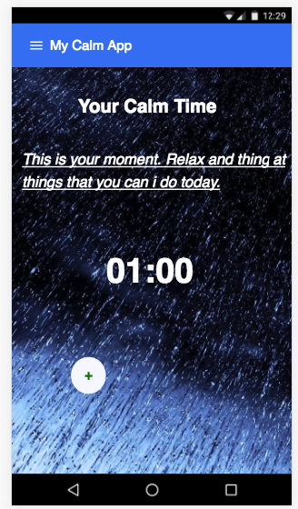

# My Calm App

A app to control your time meditation

# Setup
> You need that Polymer CLI has installed globally
- Clone this repository
- Run `npm i`
- Run `polymer serve --open`

You wil see a image like this

# Roadmap for 1.0
- Change meditation sentence with Redux Actions
- Choose enviromments and show images and play correct sounds
- Play/Pause and finish meditation time session 
- Configure your time to meditation
- Set alarm to especif time to remenber user to meditation session
